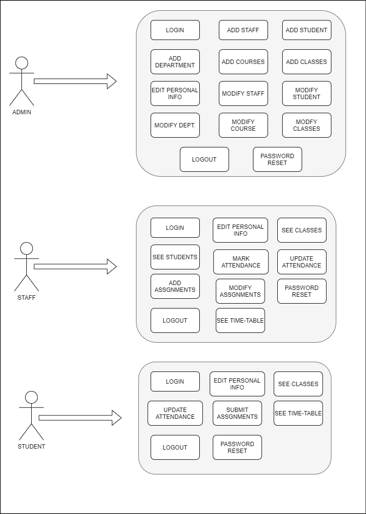
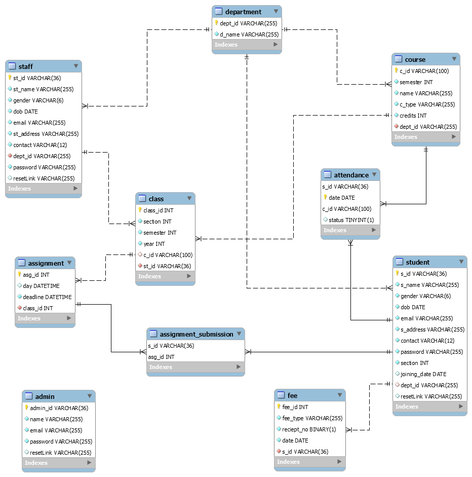
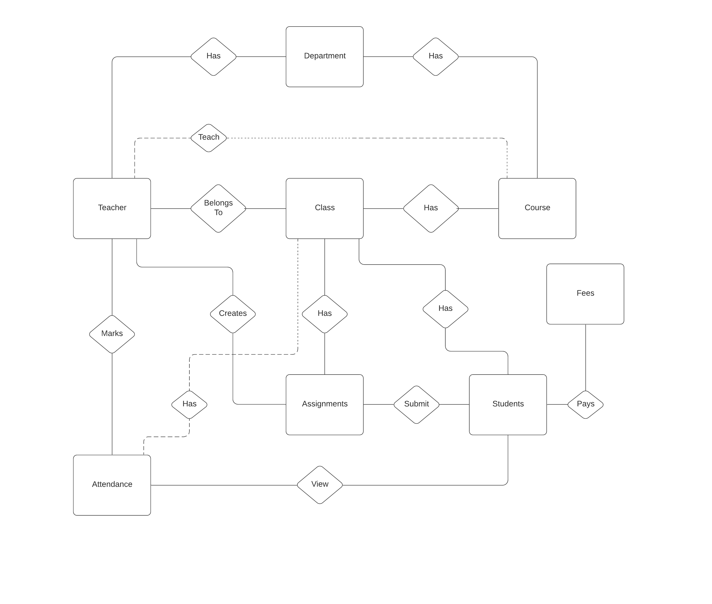
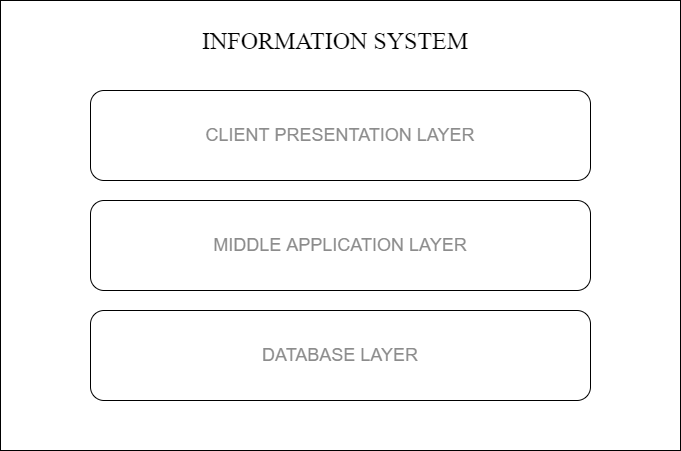

# CUMS_DBMS
🏰 A College Management Site (DBMS) using Node and Mysql.

A college management system (web application) that provides complete funtionality to manage enrollment, students, faculty, attendance, fees, scheduling,
assignments and grades for a particular college.It uses Node.js for backend and MySql as Database.

The purpose of this application is to automate the existing manual system by the help of computerized equipment and full-fledged computer software, fulfilling their requirements, so that their valuable data/information can be stored for a longer period with easy accessing and manipulation of the same. The required software and hardware are easily available and easy to work with.

## Tech Stack

- Node.js, Express.js (backend server). 
- MySQL (relational database).
- EJS (templating for server‑side rendered views).
- HTML, CSS, JavaScript (frontend).
- Session + JWT based authentication and authorization (environment variables configured in `.env`).

## User Roles and Features

There are three main types of end users in the system: **Admin**, **Staff**, and **Student**, each with their own permissions.

- **ADMIN**  
  - View and edit details of any student or staff.  
  - Add and edit departments, courses, classes and time‑tables.

- **STAFF**  
  - View student details for their classes.  
  - Add and update assignments, marks and attendance for students.  
  - View the time‑table of a particular class.

- **STUDENT**  
  - Update profile information.  
  - Submit solutions for assignments.  
  - View marks and attendance.

## System Design

### UseCase Diagram 

This is the use case diagram which depicts the user’s interaction with the system. It also shows the relationship between the user and the different use cases in which the user is involved.

### Database Design 

We are using MySQL as our database. The main objective of this project is to use Relational Database and hence MySQL is the best choice for that. 

*User can perform the above operations without writing any database query by using our simple and convenient User Interface.*

**CLASS DIAGRAM**

**ER MODEL**

### 3-tier Architecture

-------------------------------------------------------------------------------

## Setting up Project

* Open Terminal and execute 
    `https://github.com/Vishal1003/CUMS_DBMS.git`
    `cd CUMS_DBMS`
    `npm install`
* Create following env variables (in order to connect to database and use JWT) :
  * DB_HOST
  * DB_USER
  * DB_PASS
  * PORT
  * JWT_SECRET
  * JWT_EXPIRE
  * SESSION_SECRET
* Create the database using following query in mysql : `CREATE DATABASE databasename;`
* Create tables using the sql script file in `databse/cms.sql`;
* To seed data in the database run to file in `seed` folder
* To start the application execute `npm start`

## Project Status and Future Work

This project is an academic/learning‑oriented implementation of a college management system.
Possible future improvements:

- Add role‑based dashboard analytics (e.g., attendance stats, marks distribution).
- Improve UI/UX with a modern component library and responsive design.
- Integrate email/SMS notifications for important events (results, attendance shortage, etc.).

